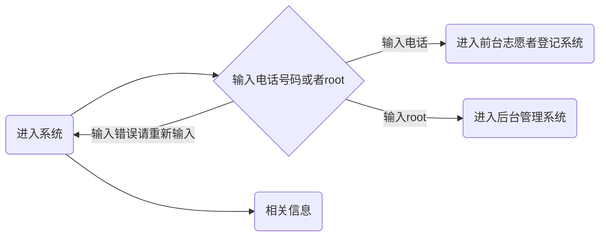
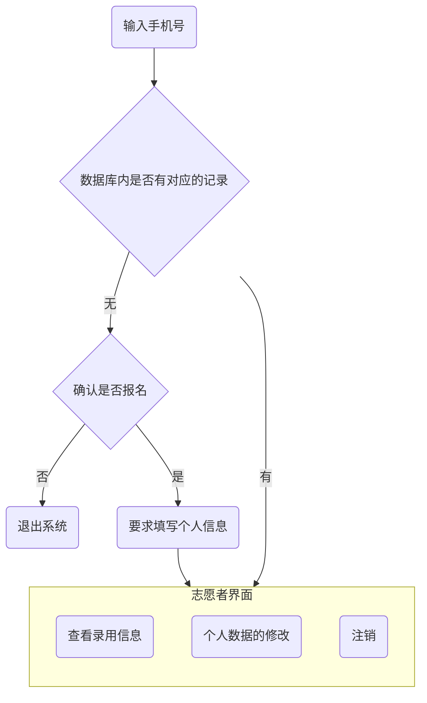
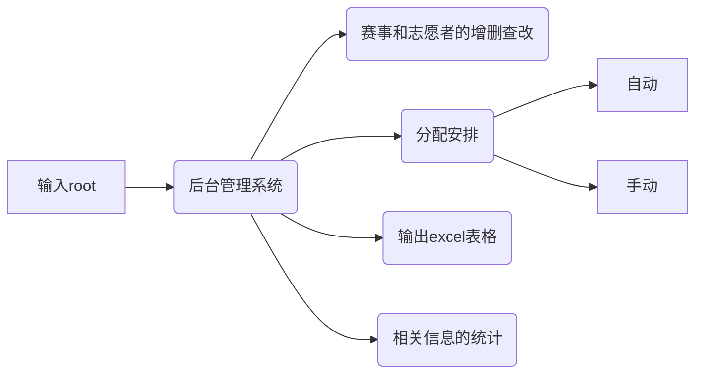

# 亚运会志愿者管理系统

```mermaid
flowchart LR
	id0(进入系统)-->id1{输入电话号码或者root}
	id2(进入前台志愿者登记系统)
	id3(进入后台管理系统)
	id1--输入电话-->id2
	id1--输入root-->id3
	id1--输入错误请重新输入-->id0
	id4(相关信息)
	id0-->id4
```

```mermaid
flowchart TB
	id0(输入手机号)
	id1{数据库内是否有对应的记录}
	id0-->id1
	subgraph 志愿者界面
		direction TB
		id8(查看录用信息)
		id6(个人数据的修改)
		id7(注销)
	end
	id3{确认是否报名}
	id1--有-->志愿者界面
	id1--无-->id3
	id4(退出系统)
	id5(要求填写个人信息)
	id3--否-->id4
	id3--是-->id5
	id5-->志愿者界面
```

```mermaid
flowchart LR
	输入root-->id
	id(后台管理系统)
	id0(赛事和志愿者的增删查改)
	id1(分配安排)
	id1-->自动
	id1-->手动
	id3(输出excel表格)
	id4(相关信息的统计)
	id-->id0
	id-->id1
	id-->id3
	id-->id4
```

