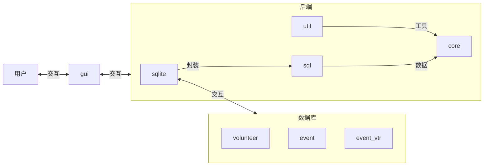

# 亚运会志愿者管理系统

## 0.背景

## 1.技术栈、使用工具

技术栈 QT5  C++ sqlite3

visual studio

## 2.结构介绍


### 数据库设计
志愿者的语言掌握情况用一个int8表示，从数据库读取到程序时转化为一个布尔型的数组

志愿者的可供的时间用一个字符串表示 如`0-0,8-22,8-22,8-12,0-0` 0-0表示当天没空我们认为运动会只举办5天，小型运动会

event表存放事程信息

Event_Vtrs表实现event表和volunteer表的关联，存放安排信息
```sqlite
CREATE TABLE Volunteer(
    `id` INTEGER PRIMARY KEY AUTOINCREMENT,
    `name` CHAR(20) NOT NULL,
    `gender` CHAR(1) NOT NULL,
    `age` TINYINT NOT NULL,
    `telephone` CHAR(20) NOT NULL,
    `idCard` CHAR(20) NOT NULL,
    `profile` CHAR(100) NOT NULL,
    `hasExp` TINYINT NOT NULL,
    `langCommand` TINYINT NOT  NULL,
    `availTime` CHAR(100) NOT NULL,
    `passwd` CHAR(20) NOT NULL
);
CREATE TABLE Event(
        `id` INTEGER PRIMARY KEY AUTOINCREMENT,
    `name` CHAR(20) NOT NULL,
    `day` TINYINT NOT NULL,
    `start` TINYINT NOT NULL,
    `end` TINYINT NOT NULL,
    `needVtrsNum` TINYINT NOT NULL,
    `needLang` TINYINT NOT NULL
);
CREATE TABLE Event_Vtrs(
        `eventId` INTEGER,
    `vtrId` INTEGER,
    FOREIGN KEY(eventId) REFERENCES Event(id),
    FOREIGN KEY(vtrId) REFERENCES Volunteer(id)
);
```
### 志愿者和事程类设计
```c++
class Event
{
public:
	int id;
	string name;
	Time time;
	bool neededLangs[LANG_NUM];
	int needVtrsNum;
	int vtrs[MAX_NEEDED_VTRS];
	bool collapse(Event& e);
	//返回一个所有能参加的志愿者的索引数组
	vector<int> vtrs_may_attend(VtrVec* vv, vector<int>* sortedVtrs);
	//返回所有可能的组合
	vector<vector<int>> getAllPossibilities(VtrVec* vv, vector<int>* sortedVtrs);
	bool islangMet(PVtrVec pvv);
};
class Volunteer 
{
public:
	int id;
	string name;
	string gender;
	int age;
	string telephone;
	//身份证
	string idCard;
	//个人简介
	string profile;
	bool hasExp;
	//存储语言掌握情况
	bool langCommand[LANG_NUM];
	//认为一天志愿者提供的时间是连续的，availTime[n][0]表示
	//志愿者开始的有空的时间，availTime[n][1]表示结束
	//在数据库里以"8-22,9-22,10-22,...."五个连续以','分割的一对数值表示
	//0-0表示当天没空
	int availTime[DAYS_NUM][2];
	string passwd;
	int result[MAX_ATTEND_EVENT];
	bool available(Time& e);
	//bool available();
	string insertSql();
	string deleteSql();
	string updateSql();
	string toTimeStr();
	string toLangsStr();
	//int vtrHours();
private:
	int getLangCode();
};

```
### 结构设计
下面是整个项目的结构

```

|-- LICENSE.txt
|-- README.md
|-- core
|   |-- core.cpp
|   `-- core.h
|-- gui
|   |-- SignUp
|   |   |-- signup.cpp
|   |   |-- signup.h
|   |   `-- signup.ui
|   |-- User
|   |   |-- user.cpp
|   |   |-- user.h
|   |   `-- user.ui
|   `-- loginUI
|       |-- loginui.cpp
|       |-- loginui.h
|       `-- loginui.ui
|-- main.cpp
|-- sql
|   |-- sql.cpp
|   `-- sql.h
|-- sqlite3
|   |-- shell.c
|   |-- sql.cpp
|   |-- sqlite3.c
|   |-- sqlite3.def
|   |-- sqlite3.dll
|   |-- sqlite3.exp
|   |-- sqlite3.h
|   |-- sqlite3.lib
|   `-- sqlite3ext.h

|-- util
    |-- util.cpp
    `-- util.h

```
main.cpp是整个程序的入口，从此进入登录窗口

sqlite3存放ssqlite3.h头文件和sqlite3库的实用的函数

util存放一些程序开发时所得到的实用的函数如`vector<string> split(string s)` 等

sql存放sql.cpp和sql.h对sqlite官方提供的接口进行二次封装，方便程序的开发

core是项目的后端核心，定义了重要的类

gui是项目的前端，存放了界面类，通过用户的交互，把数据交给后端代码，并最终显示到gui界面



